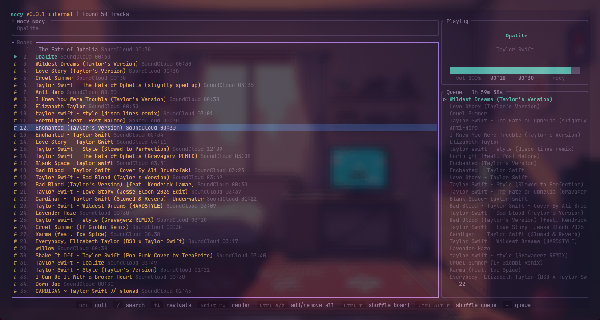

<div align="center">

# 🎵 nocy

[English](#english) | [Tiếng Việt](#tiếng-việt)




</div>

---

## English

A terminal music player that streams from SoundCloud. No GUI, no Electron eating 2GB of RAM — just a terminal window and ears that work.

### Why does this exist

- I wanted to listen to music in the terminal because why not
- Spotify requires a premium account
- VLC requires a mouse (ew)
- Writing Rust is more fun than doing actual work

### Requirements

- Rust **1.85+** (edition 2024)
- A terminal that isn't ancient

### Installation

```bash
git clone https://github.com/slattyii/nocy-rs
cd nocy-rs
cargo run --release
```

First build will take a while — Rust has a lot to compile. Go make a coffee.

> ⚠️ This is a personal project. If it doesn't run on your machine, that's a you problem.

### Layout

```
nocy v0.0.1  |  Found 50 Tracks
┌── Board ───────────────────────────────────────────┐  ┌── Playing ────────────────┐
│   1.  The Fate of Ophelia    SoundCloud  00:30     │  │                           │
│ ▶ 2.  Opalite                SoundCloud  00:30     │  │         Opalite           │
│ # 3.  Wildest Dreams         SoundCloud  00:30     │  │         Taylor Swift      │
│ # 4.  Love Story             SoundCloud  00:30     │  │                           │
│   5.  Cruel Summer           SoundCloud  00:30     │  │  ██████████████░  00:28   │
│   ...                                              │  │  vol 100%  00:30          │
└────────────────────────────────────────────────────┘  ├── Queue  1h 59m 58s ──────┤
                                                        │ ▶ Wildest Dreams          │
▶  currently playing                                    │   Love Story              │
#  in queue                                             │   ...                     │
                                                        └───────────────────────────┘
```

### Keybindings

| Key                   | Action                         |
| --------------------- | ------------------------------ |
| `Space`               | Pause / Resume                 |
| `/`                   | Search                         |
| `↑` / `↓`             | Navigate                       |
| `Shift ↑` / `Shift ↓` | Reorder tracks                 |
| `Ctrl a`              | Add all to queue               |
| `Ctrl z`              | Remove all from queue          |
| `Ctrl r`              | Shuffle board                  |
| `Ctrl Alt r`          | Shuffle queue                  |
| `~`                   | Toggle queue panel             |
| `Del`                 | Quit (and return to real life) |

### Built With

| Crate                                                  | Purpose          |
| ------------------------------------------------------ | ---------------- |
| [ratatui](https://github.com/ratatui-org/ratatui)      | TUI framework    |
| [rodio](https://github.com/RustAudio/rodio)            | Audio playback   |
| [reqwest](https://github.com/seanmonstar/reqwest)      | HTTP client      |
| [scraper](https://github.com/causal-agent/scraper)     | HTML scraping    |
| [tokio](https://tokio.rs/)                             | Async runtime    |
| [crossterm](https://github.com/crossterm-rs/crossterm) | Terminal backend |

### Platform Support

| OS                 | Status                     |
| ------------------ | -------------------------- |
| My machine (Linux) | ✅ Works great             |
| Mac                | 🤷 Untested, probably fine |
| Windows            | 🙏 Good luck               |
| Your machine       | ❓ No idea                 |

### License

[MIT](LICENSE) — do whatever you want with it. If you fork this and get rich, let me know.

---

## Tiếng Việt

Một terminal music player stream nhạc từ SoundCloud. Không cần GUI, không cần Electron ngốn 2GB RAM — chỉ cần một cửa sổ terminal và đôi tai biết nghe nhạc.

### Tại sao lại có cái này

- Tui nghe nhạc bằng terminal vì... tại sao không?
- Spotify thì cần account premium
- VLC thì phải dùng chuột (ew)
- Viết Rust thì vui hơn làm việc thật sự

### Yêu cầu

- Rust **1.85+** (edition 2024)
- Một terminal không quá cổ lỗ sĩ

### Cài đặt

```bash
git clone https://github.com/slattyii/nocy-rs
cd nocy-rs
cargo run --release
```

Lần đầu build sẽ lâu vì Rust phải compile mấy chục crates. Đi pha ly cà phê đi, tui chờ.

> ⚠️ Đây là dự án cá nhân. Nếu chạy không được trên máy bạn thì... đó là vấn đề của bạn.

### Giao diện

```
nocy v0.0.1  |  Found 50 Tracks
┌── Board ───────────────────────────────────────────┐  ┌── Playing ────────────────┐
│   1.  The Fate of Ophelia    SoundCloud  00:30     │  │                           │
│ ▶ 2.  Opalite                SoundCloud  00:30     │  │         Opalite           │
│ # 3.  Wildest Dreams         SoundCloud  00:30     │  │         Taylor Swift      │
│ # 4.  Love Story             SoundCloud  00:30     │  │                           │
│   5.  Cruel Summer           SoundCloud  00:30     │  │  ██████████████░  00:28   │
│   ...                                              │  │  vol 100%  00:30          │
└────────────────────────────────────────────────────┘  ├── Queue  1h 59m 58s ──────┤
                                                        │ ▶ Wildest Dreams          │
▶  đang phát                                            │   Love Story              │
#  trong queue                                          │   ...                     │
                                                        └───────────────────────────┘
```

### Phím tắt

| Phím                  | Tác dụng                             |
| --------------------- | ------------------------------------ |
| `Space`               | Pause / Resume                       |
| `/`                   | Tìm kiếm                             |
| `↑` / `↓`             | Di chuyển                            |
| `Shift ↑` / `Shift ↓` | Đổi thứ tự track                     |
| `Ctrl a`              | Thêm tất cả vào queue                |
| `Ctrl z`              | Xóa tất cả khỏi queue                |
| `Ctrl r`              | Shuffle board                        |
| `Ctrl Alt r`          | Shuffle queue                        |
| `~`                   | Ẩn / hiện queue                      |
| `Del`                 | Thoát (và trở lại với cuộc đời thực) |

### Thư viện sử dụng

| Crate                                                  | Mục đích         |
| ------------------------------------------------------ | ---------------- |
| [ratatui](https://github.com/ratatui-org/ratatui)      | TUI framework    |
| [rodio](https://github.com/RustAudio/rodio)            | Phát audio       |
| [reqwest](https://github.com/seanmonstar/reqwest)      | HTTP client      |
| [scraper](https://github.com/causal-agent/scraper)     | Scrape HTML      |
| [tokio](https://tokio.rs/)                             | Async runtime    |
| [crossterm](https://github.com/crossterm-rs/crossterm) | Terminal backend |

### Hỗ trợ nền tảng

| OS              | Tình trạng                  |
| --------------- | --------------------------- |
| Máy tui (Linux) | ✅ Chạy ngon                |
| Mac             | 🤷 Chưa test, probably fine |
| Windows         | 🙏 Cầu may                  |
| Máy bạn         | ❓ Không biết               |

### License

[MIT](LICENSE) — dùng đi, tui không quan tâm lắm. Nếu bạn fork về làm triệu phú thì kể tui nghe với.

---

<div align="center">

_made with ♥ and too much caffeine_

</div>
